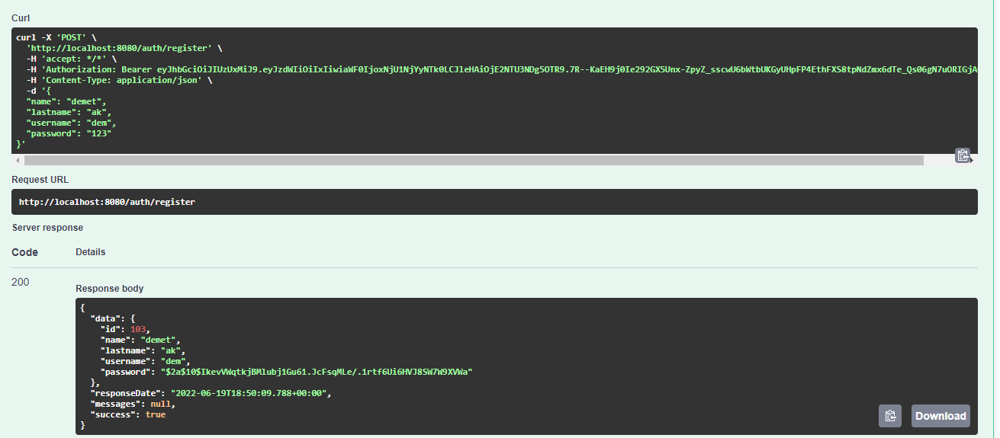
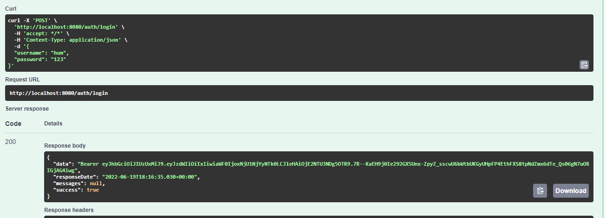
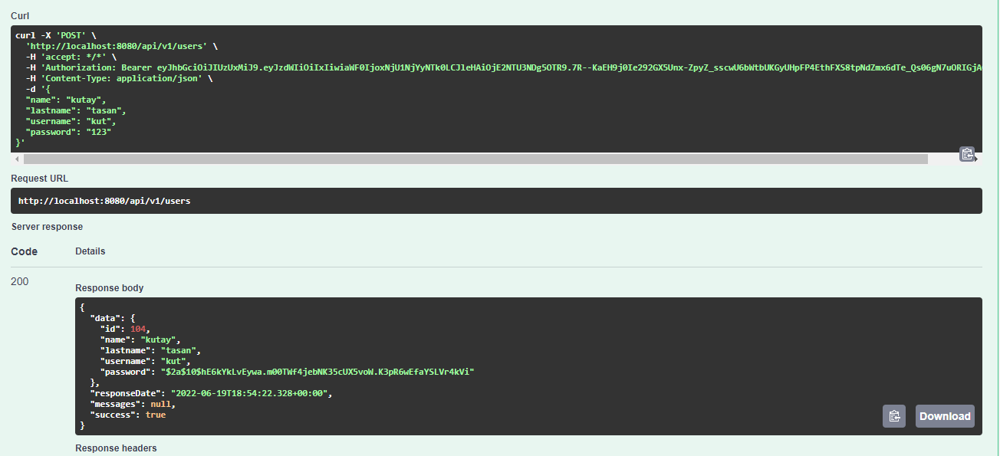
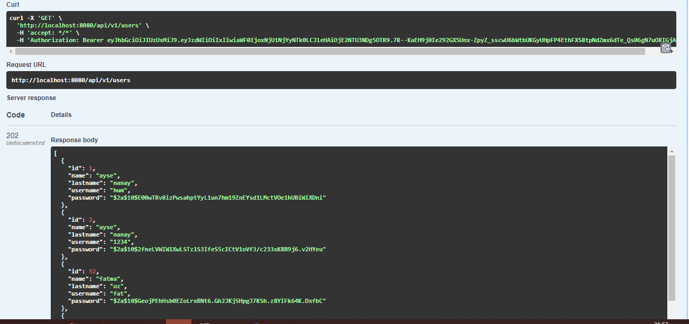
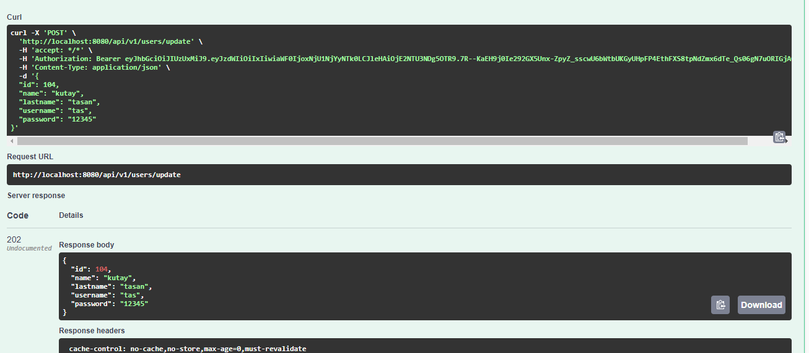
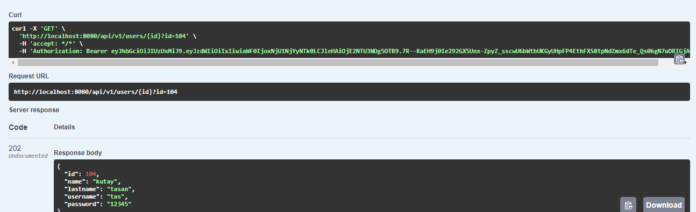
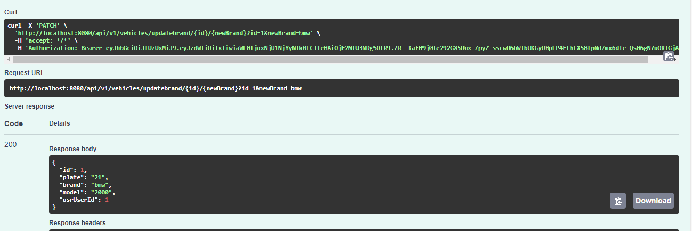

# Ödev için master branche bakabilirsiniz.
## Register 

##Login, generate token

##Post user

## Get users

## update users

## Get users

##Change password

##Give error when the same username is used.

## Post vehicle

## get user by id

##update model

##update brand

